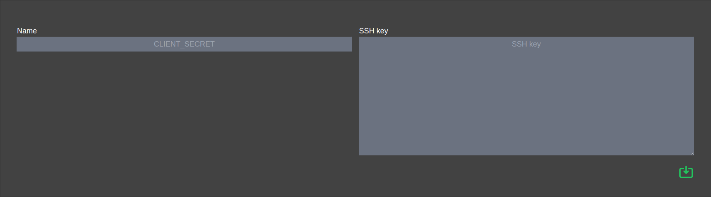

[BACK](../README.md)
___
# Credentials

The credentials allow Free Commit to work with your repository.

### Creation

<table>
    <tr>
        <th>Name</th>
        <td>Credential Name (Github, Gitlab)</td>
    </tr>
    <tr>
        <th>SSH key</th>
        <td>Private SSH key</td>
    </tr>
</table>

###### Note 

The private key will be encrypted and it will never come back to the client

##### Shortcut

* [Create project](project.md)
* [Configure SSH key with Github](https://docs.github.com/en/authentication/connecting-to-github-with-ssh/generating-a-new-ssh-key-and-adding-it-to-the-ssh-agent)
* [Configure SSH key with Gitlab](https://docs.gitlab.com/ee/ssh)

___
[BACK](../README.md)