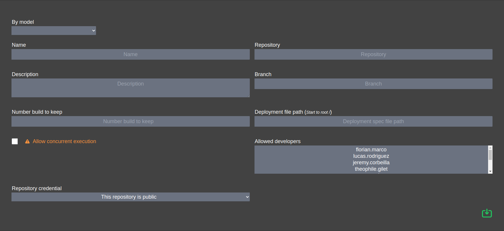

[BACK](../README.md)
___

# Project

The project is a skeleton of this software.

### Creation



<table>
    <tr>
        <th>By model</th>
        <td>Copy params from other project</td>
    </tr>
    <tr>
        <th>Name</th>
        <td>Project name</td>
    </tr>
    <tr>
        <th>Description</th>
        <td>Project description</td>
    </tr>
    <tr>
        <th>Number build to keep</th>
        <td>...</td>
    </tr>
    <tr>
        <th>Allow concurrent execution</th>
        <td>False by default, if true, Free Commit can execute two build simultaneously</td>
    </tr>
    <tr>
        <th>Repository</th>
        <td>SSH Link of your repository</td>
    </tr>
    <tr>
        <th>Branch</th>
        <td>Target branch</td>
    </tr>
    <tr>
        <th>Deployment file</th>
        <td>We will come back</td>
    </tr>
    <tr>
        <th>Allowed developer</th>
        <td>Developers who can deploy</td>
    </tr>
    <tr>
        <th>Repository credential</th>
        <td>If your repository is public, leave it empty, otherwise add credentials and assign it to this project</td>
    </tr>
</table>

##### Specific case

If you need to listen for other events (like writing a issue comment), you can set "*" to branch, the retrieved branch
will be
master.

Also note that you can retrieve the body of the request in your execution container.

```bash
apt-get install jq -y

echo "$(printenv FREE_COMMIT_REQUEST_BODY)" > payload.json

echo "$(jq '.repository.id' payload.json)"
```

##### Shortcut

* [Add credentials](credential.md)

### Deployment file

Your deployment file will orchestrate the build.

```yaml
# Optional
version: '1.0'

# Docker image base (for more performance, you can prepare your custom image)
from: 'ubuntu:focal'

# Steps (Make atomic step)
steps:
    # Only for repair in output
    -   name: '@install'
        # From base project
        script: '.free-commit/live/install.sh'

    -   name: '@test'
        script: '.free-commit/live/test.sh'

    -   name: '@resolve-version'
        script: '.free-commit/live/version.sh'

    -   name: '@build'
        script: '.free-commit/live/build.sh'

    -   name: '@deploy'
        script: '.free-commit/live/deploy.sh'

    -   name: '@tag'
        script: '.free-commit/live/tag.sh'
```

All your steps will be a simple shell script

___
[BACK](../README.md)