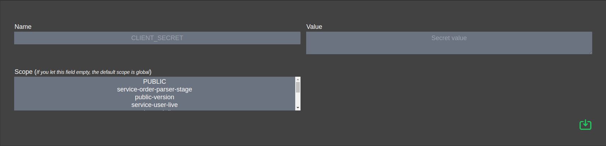

[BACK](../README.md)
___
# Secret

Secrets are passed to the projects they are assigned to.

They are like environment variables, encrypted in a database and partitioned by assignment to specific projects.

They are then passed as environment variables to running docker containers.


### Creation



<table>
    <tr>
        <th>Name</th>
        <td>Secret Name (This name will used in your docker container)</td>
    </tr>
    <tr>
        <th>Value</th>
        <td>...</td>
    </tr>
    <tr>
        <th>Scope</th>
        <td>One or many project. Can be global (PUBLIC)</td>
    </tr>
</table>

###### Note 

The secret with global scope will systematically passed in your docker container

#### Retrieve secret in container

```shell script
printenv SECRET_NAME
```

___
[BACK](../README.md)